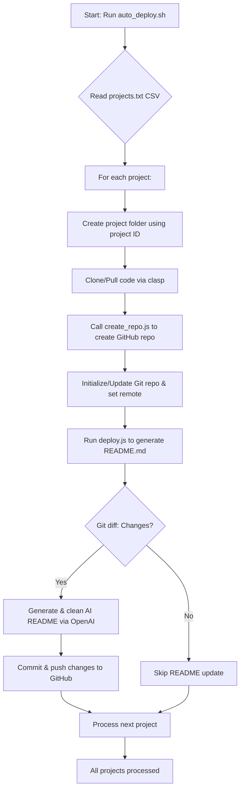

# 🚀 GAS Auto-Deploy & AI README Updater

> **Automate your Google Apps Script deployments!**  
> This package makes it effortless to sync your GAS projects with GitHub, auto-create repositories, and generate stunning, AI-powered documentation—only when changes occur.

---

## Table of Contents

- [Features](#features)
- [Repository Structure](#repository-structure)
- [Setup Instructions](#setup-instructions)
- [Usage](#usage)
- [How It Works](#how-it-works)
- [Troubleshooting](#troubleshooting)
- [License](#license)

---

## ✨ Features

- **Automated Cloning/Updating:**  
  Uses **clasp** to clone or update your GAS projects based on a CSV file in which you've pasted in your GAS project IDs and plain text project names. 

- **Automatic GitHub Repo Creation:**  
  Automatically creates private GitHub repositories (via the GitHub API) using human-friendly names.

- **AI-Powered README Generation:**  
  Uses your OpenAI API key and choice of model to generate a beautiful, formatted README only when changes are detected.  
  (The process will also clean up any unwanted formatting produced by the AI.)

- **Seamless Git Integration:**  
  Commits and pushes changes to GitHub using a Personal Access Token (PAT) for authentication.

---

## 📁 Repository Structure

```
.
├── auto_deploy.sh       # Bash script to process GAS projects.
├── create_repo.js       # Node.js script to create GitHub repositories via API.
├── deploy.js            # Node.js script to generate/update README.md via OpenAI.
├── projects.txt         # CSV file: <gas_project_id>,<english_project_name>
├── package.json         # Node.js package configuration.
└── README.md            # This file!
```

---

## 🛠️ Setup Instructions

1. **Clone this Repository**  
   Clone or download the package to your local machine.

2. **Edit `projects.txt`**  
   Populate the file with your GAS project IDs and their corresponding English names, one per line:
   ```
   1AdfMNF0iSIBI9qsExample,Invoice Generator
   10z785_gD9KmS42Example,Time Tracker
   ```

3. **Configure Your Credentials**  
   - In `auto_deploy.sh`, update:
     - `GITHUB_USER` with your GitHub username.
     - `GITHUB_PAT` with your GitHub Personal Access Token.
     - Adjust the file paths if necessary.
   - In `deploy.js`, update `OPENAI_API_KEY` with your OpenAI API key.

4. **Install Node Dependencies**  
   In the repository directory, run:
   ```bash
   npm init -y
   npm install axios
   ```

5. **Make the Bash Script Executable**  
   ```bash
   chmod +x auto_deploy.sh
   ```

---

## 🚀 Usage

Simply run the automation script from your terminal:
```bash
./auto_deploy.sh
```

The script will:
- **Read** your projects from `projects.txt`.
- For **each project**:
  - Create/update a local folder.
  - Clone or update the GAS project via **clasp**.
  - Automatically **create a GitHub repository** (if not already present) using the provided English name.
  - Initialize/update the Git repository and set the correct remote using your PAT.
  - Execute the **deploy.js** script to generate an AI-powered `README.md` (only if changes are detected) and push updates to GitHub.

---

## ⚙️ How It Works



---

## 🐞 Troubleshooting

- **No Changes Detected:**  
  If the script says "No changes detected. Skipping README update and git push.", then your local repository is already up-to-date.

- **Authentication Issues:**  
  Ensure your GitHub PAT and OpenAI API key are correct and have the necessary permissions.

- **Repository Creation Errors:**  
  Verify your repo names meet GitHub's naming standards. Adjust the sanitation function if needed.

- **Clasp Issues:**  
  Make sure **clasp** is installed and logged in properly (`clasp login`).


---

## 🙌 Contributing

Feel free to fork this repository and submit pull requests with improvements. Happy coding and enjoy automating your deployment process! 🚀

Feature Roadmap

### 1. Two-Way Synchronization
- **Bidirectional Sync:**  
  Enable two-way synchronization so that changes in GitHub can be pushed back to Google Apps Script (GAS) projects. This would allow developers to work from either the local GitHub repository or directly in the GAS Editor and synchronize changes seamlessly.
- **Conflict Resolution:**  
  Implement conflict detection and resolution mechanisms to handle simultaneous updates from both ends.

### 2. Enhanced Deployment & Rollback Capabilities
- **Automated Rollbacks:**  
  Add functionality to quickly rollback to previous versions in GitHub if a recent change introduces issues.
- **Version Tagging & Changelogs:**  
  Automatically create version tags and generate changelogs from commit diffs and OpenAI summaries.

### 3. Improved Repository Management
- **Repository Name & Description Retrieval:**  
  Integrate with the GAS API (or store additional metadata) to automatically retrieve the “English” project title and description, rather than relying solely on manual CSV configuration.
- **Bulk Repository Settings:**  
  Allow for additional repository configuration (e.g., topics, license, branch protection rules) using GitHub’s API.

### 4. Automation & Integration
- **Scheduled Synchronization:**  
  Implement a scheduling module (or support integration with CI/CD tools) so that updates run automatically at defined intervals without manual triggering.
- **Notification System:**  
  Integrate email or Slack notifications to alert developers when repositories are updated or when conflicts occur in synchronization.

### 5. Enhanced README Generation & Customization
- **Customizable Templates:**  
  Allow users to define custom templates for README generation. This way, teams can standardize documentation across projects.
- **Inline Code Highlighting & Visuals:**  
  Improve the output from OpenAI by incorporating better code highlighting and richer visuals in the generated documentation.

### 6. Developer Experience & Tooling
- **Comprehensive Logging & Dashboard:**  
  Build a web dashboard to monitor the synchronization status, view logs, and manage projects.
- **CLI Enhancements:**  
  Expand the command-line interface to provide more detailed feedback and interactive prompts for configuration and troubleshooting.

